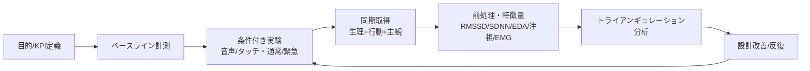

# 自動車HMIのUX評価方法 提案書 — 生理指標に基づくマルチモーダル評価フレームワーク

本提案は、収集した全26文献（01〜29）を根拠に、自動車HMI（Human-Machine Interface）の
ユーザー体験（UX）を客観的に評価する実践的な方法を提示するものです。
各節には根拠文献を明記しています。

---

## 1. 提案の背景と狙い

自動車HMIは、車載インフォテインメント（IVI）・メーター・音声/タッチ操作・自動運転の
テイクオーバーなど、ドライバーの認知資源を奪いうる要素が増大しています
（Sunil & Dhoot / Sriranga 2023 [11]）。従来のアンケート等の主観評価だけでは、
運転中の無意識的・非言語的な負荷やストレスを捉えきれません
（Peruzzini 2018 [01]、Czaban 2025 [03]）。

そこで本提案では、**主観評価＋生理指標＋行動/性能指標を統合したマルチモーダルUX評価**を
中核に据えます。これは製品設計分野で確立した「生理データによるUX定量化」の枠組み
（Peruzzini 2018 [01]、Cescon & Peruzzini [15]）を、自動車HMIに特化して再構成したものです。

---

## 2. 評価の3層モデル（トライアンギュレーション）

UXは単一指標では捉えられないため、以下の3層を組み合わせます
（Cescon & Peruzzini [15]、da Silveira 2025 [21]、Ren 2024 [26] の主観×生理の一致検証）。

| 層 | 測るもの | 主な指標 | 根拠文献 |
|----|---------|---------|---------|
| ① 生理層 | 自律神経・情動・認知負荷 | HRV(RMSSD/SDNN)、EDA/GSR、瞳孔、表情筋EMG、EEG | [01][03][11][21][23] |
| ② 行動/性能層 | 運転・タスク成績 | テイクオーバー時間、逸脱、操作時間、視線逸れ | [12][14][16] |
| ③ 主観層 | 体験の自己申告 | SUS、UEQ、NASA-TLX、VRNQ 等 | [05][09][15] |

**設計原則**: 主観と生理指標が一致したときに結論の妥当性が高まる
（Ren 2024 [26]、Kerr 2023 [09] のRCTでの有効性×UX両立）。

---

## 3. 推奨する生理指標と役割分担

自動車ドメインの知見と、心拍以外の生理指標レビューを踏まえた指標選定です。

### 3.1 心拍変動（HRV）— ストレス・作業負荷の中核指標
- **RMSSD**: 副交感神経（リラックス/回復）を反映。負荷が上がると低下
  （Shin 2025 [04]、Shafi 2026 [05]）。短時間評価で安定して算出でき、
  イベント単位のHMI操作評価に適する（Quintero 2021 [02]）。
- **SDNN**: 交感＋副交感の総合バランス。より長い計測窓が望ましい
  （基礎: Task Force 1996 / Shaffer 2017 [10]、Quintero 2021 [02]）。
- **妥当性の裏付け**: 多数の生理指標のうち、運転UX研究で信頼性・妥当性の両面で
  有効だったのは RMSSD と SDNN（Czaban 2025 [03]）。
- **重要な注意**: RMSSDの感度は自動化レベル・タスクに依存し、常に有意差が出るとは
  限らない（Sriranga 2023 [11]）。→ 単独に頼らず複数HRV指標・他モダリティを併用。

### 3.2 皮膚電気活動（EDA/GSR）— 情動的覚醒の実務的第一選択
- 導入が容易で情動的覚醒・ストレス反応の計測に有力（Baig & Kavakli 2019 [23]、
  Ganglbauer 2009 [27]）。HRVと組み合わせて負荷急変を捉える（Peruzzini 2018 [01]）。

### 3.3 眼球運動・瞳孔 — 視覚的注意と認知負荷
- **アイトラッキング**: HMIの「どこを見て、どこで迷うか」＝視覚的注意配分・混乱箇所を
  特定（Ball & Richardson 2024 [25]、Majumder 2025 [29]）。運転の前方注意逸れの評価に直結
  （Salazar-Calderón 2025 [17]）。
- **瞳孔測定**: 認知負荷・覚醒の推定に有用だが、車内は照明変動が大きく解釈に注意
  （Ganglbauer 2009 [27]、Ball & Richardson 2024 [25]）。

### 3.4 表情筋EMG — 情動価（快/不快）の高感度検出
- 快/不快の情動価を高感度に検出（Taffese 2017 [24]、Akan & Berkman 2020 [28]）。
  苛立ち・フラストレーションの検知に補助的に活用。

### 3.5 EEG（脳波）— 認知負荷の精緻評価（任意）
- 認知負荷・注意の評価に強いがセットアップが複雑で運転実車では実用性が低い
  （Taffese 2017 [24]、da Silveira 2025 [21]）。シミュレータ精査時のオプション。

> **指標選定の原則**: 目的（負荷か情動か注意か）に応じて選び、単一でなく併用する
> （マルチモーダル）。GSR/EDAとアイトラッキングを基本線に、HRVでストレス、
> 表情筋EMGで情動価を補完（[21][22][23]）。

---

## 4. 評価シナリオ設計（負荷の対比を作る）

UXの良し悪しは「条件間の差」で判断します。難易度・様式の異なる条件を用意します。

1. **HMI様式の比較**: 音声 vs タッチ vs 物理ボタン等。最適解はタスク・文脈依存
   （Rasheduzzaman 2023 [16]、Jeong 2018 [12] の代替操作系評価）。
2. **通常 vs 高負荷/緊急シナリオ**: 難易度差で生理反応の弁別力を確認
   （Shafi 2026 [05] のroutine/emergency設計）。
3. **自動運転テイクオーバー**: 制御引き継ぎ性能を予測できるHRV指標を選定
   （Zhang 2025 [14] の35指標比較）。
4. **混合プロトタイピング**: 実車前にVR/モックアップで安価に体験を再現し早期評価
   （Peruzzini 2018 [01]）。

---

## 5. 計測・前処理の実務要件

車内計測は体動・振動によるアーティファクトが多く、品質管理が成否を分けます。

- **アーティファクト対策**: HRVは前処理（異常拍除去・ノイズ除去）と計測窓設計が必須
  （自動車HMI READMEの総括、基礎 [10]、Sriranga 2023 [11]）。
- **計測窓の使い分け**: 短時間イベント評価はRMSSD、長めの区間はSDNN
  （Quintero 2021 [02]、Shaffer 2017 [10]）。
- **センサ選定**: 接触型（ステアリング埋込・ウェアラブル）と非接触型を運転妨害の
  少なさで選ぶ（Sriranga 2023 [11]、Riener 2017 [13]）。
- **同期記録**: HMIイベント（メニュー操作・警告提示）と生理/行動データを時間同期
  （Quintero 2021 [02] のイベント同期、Riener 2017 [13] のDriver-in-the-Loop）。

---

## 6. 指標の解釈ルール（UXの良し悪しの判定）

| 観測 | 解釈 | 根拠 |
|------|------|------|
| RMSSD/SDNN 低下・HR上昇 | 負荷/ストレス増（UX悪化の兆候） | [03][04][05][11] |
| RMSSD/HRV 維持・上昇 | 低負荷/快適（良好UX） | [04][06][09] |
| EDA上昇スパイク | 情動的覚醒・驚き/ストレス | [23][27] |
| 注視分散・長い探索・前方逸れ増 | UIの分かりにくさ/混乱 | [25][29] |
| 皺眉筋EMG上昇 | 不快・フラストレーション | [24][28] |
| 主観(SUS/NASA-TLX)と生理が一致 | 結論の妥当性が高い | [09][26] |

> 良好な自動車HMIとは、**同一タスクを、より低い生理的負荷（HRV維持・EDA安定）、
> より短い視覚的探索、より高い主観満足で完了できる**設計です（[05][12][16]）。

---

## 7. 提案する評価プロトコル（手順）

1. **目的定義とKPI設定**: 負荷低減/注意保持/情動満足のどれを重視するか（[15][17]）。
2. **ベースライン取得**: 安静時のHRV/EDA基準値を測定（個人差補正、[10]）。
3. **条件付き実験**: §4のシナリオで、生理＋行動＋主観を同期取得（[02][05]）。
4. **前処理・特徴量抽出**: RMSSD/SDNN、EDA位相成分、注視指標、EMGを算出（[10][11]）。
5. **条件間比較・統合分析**: 主観×生理×性能のトライアンギュレーション（[26][15]）。
6. **設計改善へ反映**: 混合プロトタイプで反復改善（ユーザー中心設計、[01][07]）。

---

## 付録A. センサ機材の具体案

車内・シミュレータ環境での実用性に加え、**参加者への負担の少なさ（非接触＞低装着感＞
接触）を最優先**の選定基準とします。運転を妨げず装着ストレスが少ないほど、そのストレス
自体が生理指標へ混入する交絡を避けられ、UX評価の妥当性が高まります
（Sriranga 2023 [11]、Riener 2017 [13]、Ganglbauer 2009 [27]）。

### A.0 負担度ランクの考え方
- **ランク1（非接触）**: 身体に何も装着しない。カメラ・レーダー・遠隔センサ。最優先。
- **ランク2（低装着感）**: リストバンド・指クリップなど軽量で運転を妨げないもの。次点。
- **ランク3（接触・要装着）**: 胸部電極・顔面/頭部電極など。負担大のため原則シミュレータの
  精査時に限定し、常用は避ける。

### A.1 指標別・推奨センサ（負担の少ない順に選定）

| 指標 | 第1候補（非接触/低負担） | 代替（精度重視・負担やや大） | サンプリング | 負担度 | 選定根拠 |
|------|------------------------|--------------------------|------------|-------|---------|
| HRV(RMSSD/SDNN) | 非接触rPPG（車内カメラ・顔面撮影）／ミリ波レーダー心拍／ステアリング埋込ECG・PPG（把持のみ） | リストバンドPPG（Empatica EmbracePlus, Polar Verity Sense 腕装着） | rPPG/レーダー ≥ 30–60 fps、PPG ≥ 64 Hz | 1〜2 | [02][10][11][17] |
| EDA/GSR | ステアリング/シフト埋込電極（把持で計測、装着なし）／足底電極（靴内） | 手首/指のリストバンド型（Empatica, Shimmer3 GSR+） | 4–32 Hz | 1〜2 | [23][27] |
| 眼球運動 | 遠隔（リモート）アイトラッカー（Smart Eye, Seeing Machines, Tobii Pro Spectrum/Nano）＝ダッシュ設置・非装着 | 装着型グラス（Tobii Pro Glasses 3） | 60–250 Hz | 1 | [17][25][29] |
| 瞳孔径 | 上記リモートアイトラッカー内蔵（非接触）＋照度ログ | 装着型グラス内蔵 | 60–250 Hz | 1 | [25][27] |
| 表情・情動価 | **カメラ表情解析（非接触, FACS/AU推定）** で表情筋EMGを代替 | 顔面表面EMG（精査時のみ, シミュレータ） | 動画 ≥ 30 fps／EMG ≥ 1000 Hz | 1（代替）／3 | [21][24][28] |
| 認知負荷（任意） | 上記の瞳孔・注視・rPPGで代替（非接触） | 乾式EEG（負担大, 常用非推奨） | — | 1（代替）／3 | [21][24] |
| 運転/行動 | シミュレータログ、CANバス、車内カメラ、外部トリガ（すべて非接触） | — | イベント時刻 | 1 | [02][12][14] |

> 表情筋EMG・EEGは高感度だが頭部/顔面への電極装着が必要で負担が大きいため
> （Taffese 2017 [24]）、**まずカメラ表情解析・瞳孔・注視といった非接触指標で代替**し、
> どうしても微細な情動価が必要な精査段階のみ、シミュレータで限定使用します（[21][28]）。

### A.2 非接触/低負担を優先した推奨構成
- **基本セット（すべて非接触・装着ゼロ）**:
  1. リモートアイトラッカー（注視・瞳孔）
  2. 非接触rPPG or ステアリング埋込PPGでHRV（RMSSD/SDNN）
  3. カメラ表情解析（情動価）
  4. シミュレータ/CANログ（行動・性能）
  → 参加者は「座って運転するだけ」で全指標を取得でき、装着ストレスによる交絡を排除
  （Ganglbauer 2009 [27] の実用性重視、Sriranga 2023 [11]）。
- **低装着感の補強（必要時のみ）**: EDAの精度が重要な場合のみ、リストバンド型GSRを追加。
  胸部ECG・顔面EMG・EEGは原則使わず、使う場合もシミュレータの精査回に限定（[23][24]）。

### A.3 実装のポイント
- **非接触計測の品質管理**: rPPG/レーダーは体動・照明・振動に弱いため、車内照明の安定化と
  動き補正を行い、計測窓は短時間評価のRMSSDを主軸に（Sriranga 2023 [11]、[02][10]）。
  精度が要る比較では、把持中のみ有効なステアリング埋込PPG/ECGで補完。
- **同期基盤**: Lab Streaming Layer（LSL）等で全信号（カメラ/レーダー含む）を共通
  タイムスタンプに整列。HMIイベントはハードウェアトリガ/マーカーで打刻
  （Quintero 2021 [02]、Riener 2017 [13]）。
- **照度・環境ログ**: 瞳孔径・rPPGは照明変動に弱いため、車内照度センサを併設し共変量化
  （Ganglbauer 2009 [27]、Ball & Richardson 2024 [25]）。
- **トレードオフの明示**: 非接触化は負担・交絡を減らす一方で信号品質が下がりうるため、
  相対変化（条件間差）で議論し、必要に応じ低装着感センサで裏取りする（[03][11]）。

---

## 付録B. 実験計画とサンプルサイズ

### B.1 推奨デザイン
- **被験者内（within-subject）反復測定デザイン**を基本とする。同一ドライバーが全HMI条件を
  経験することで個人差を統制し、検出力を高める（Czaban 2025 [03] の妥当性重視、[15]）。
- **順序効果対策**: 条件提示順をラテン方格法でカウンターバランス。
- **ベースライン補正**: 各セッション前に安静時HRV/EDAを取得し、変化量（Δ）で解析（[10]）。

### B.2 サンプルサイズの目安（事前検出力分析）
反復測定・被験者内比較を想定し、G*Power等での事前計算を推奨。代表的な目安：

| 想定効果量 | 検定 | α | 検出力(1−β) | 必要人数(目安) |
|-----------|------|---|-----------|--------------|
| 中程度 (Cohen's d≈0.5 / f≈0.25) | 対応あり t / 反復ANOVA | 0.05 | 0.80 | 約24–34名 |
| 大 (d≈0.8 / f≈0.40) | 対応あり t / 反復ANOVA | 0.05 | 0.80 | 約12–18名 |
| 小 (d≈0.3 / f≈0.15) | 反復ANOVA | 0.05 | 0.80 | 約45–60名 |

- HMIのUX/生理研究では中程度効果を想定し、脱落を見込んで **30名程度** を目安に設定。
  探索的段階（混合プロトタイプ）はより少数での反復評価も可（Wollmann 2016 [07]、[01]）。
- 実際の効果量は先行研究（Shafi 2026 [05]、Jeong 2018 [12]）や予備実験から推定すること。

---

## 付録C. 統計解析手法

### C.1 前処理・特徴量抽出（解析の前提）
- **HRV**: 異常拍（異所性拍動）除去→補間→時間領域(RMSSD, SDNN, pNN50)算出。短時間窓は
  RMSSD、長め区間はSDNN。周波数領域(LF/HF)は解釈に注意（基礎 [10]、Quintero 2021 [02]）。
- **EDA**: 位相性(SCR)と持続性(SCL)に分解（例：cvxEDA/Ledalab）。イベント関連SCRを抽出（[23][27]）。
- **アイトラッキング**: 注視回数・注視時間・サッケード・AOI滞留・前方注視率を算出（[25][29]）。
- **表情筋EMG**: 整流・平滑化後、大頬骨筋/皺眉筋の振幅を情動価指標に（[24][28]）。

### C.2 主解析（条件間比較）
- **正規性が成立**: 一元/二元 **反復測定分散分析（RM-ANOVA）**。球面性はMauchly検定→
  違反時Greenhouse-Geisser補正。事後はBonferroni/Holm補正（Shafi 2026 [05]、[15]）。
- **正規性が非成立/順序尺度**: **Friedman検定**＋Wilcoxonの符号順位（多重比較補正）。
- **効果量の併記**: partial η²、Cohen's d/dz を必ず報告（有意性だけで判断しない）。

### C.3 混合効果モデル（推奨・欠損に頑健）
- 反復・被験者ネスト・欠損に頑健な **線形混合モデル（LMM）** を推奨。
  - 固定効果：HMI条件、シナリオ難易度（通常/緊急）、これらの交互作用
  - 変量効果：被験者（ランダム切片、必要に応じランダム傾き）
  - 共変量：ベースラインHRV/EDA、年齢、運転経験、車内照度（瞳孔補正）
  - 例（R/lme4）: `RMSSD ~ HMI * Scenario + Baseline + (1|Subject)`（[03][17]）

### C.4 多指標の統合分析（トライアンギュレーション）
- **主観×生理×性能の一致検証**: 相関（Spearman）・一致度で、主観評価と生理指標の
  整合を確認（一致すれば妥当性が高い：Ren 2024 [26]、Kerr 2023 [09]）。
- **指標選定/次元縮約**: 多数のHRV/生理特徴を扱う場合、PCAや正則化回帰(LASSO)、
  ランダムフォレスト等で有効指標を選別（Zhang 2025 [14] の35指標比較の思想）。
- **多重比較管理**: 多指標を検定する際はFDR（Benjamini-Hochberg）で偽陽性を制御。

### C.5 分類・予測（応用）
- テイクオーバー成否・高負荷状態の判別に、交差検証付きの機械学習
  （SVM/RF/勾配ブースティング）を適用。**被験者単位のLOSO交差検証**で汎化性を評価
  （Zhang 2025 [14]、Sriranga 2023 [11]）。

### C.6 報告時の注意
- ベースライン補正法・前処理パラメータ・除外基準を明記（再現性、[10]）。
- 生理指標は個人差が大きいため、**絶対値でなく条件間の相対変化**で議論（[03][11]）。
- 主観と生理が乖離した場合は、その不一致自体を知見として考察（[26][27]）。

---

## 8. 提案の要点（サマリー）

1. **3層トライアンギュレーション**（生理×行動×主観）で頑健に評価（[15][26]）。
2. **HRV(RMSSD/SDNN)を負荷・ストレスの中核**に据えつつ、感度の文脈依存に注意し
   **EDA・アイトラッキングを基本併用**（[03][11][23][25]）。
3. **条件差を作るシナリオ設計**（様式比較・通常/緊急・テイクオーバー）で良し悪しを弁別
   （[05][14][16]）。
4. **車内特有のアーティファクト対策と計測窓設計**を徹底（[10][11][02]）。
5. **混合プロトタイピングで早期・反復評価**し設計改善に直結（[01][07]）。

---

## 9. 根拠文献一覧（本提案での用途）

| No. | 文献 | 本提案での主な根拠箇所 |
|-----|------|----------------------|
| [01] | Peruzzini 2018 | 生理×UX定量化、混合プロトタイピング、早期反復 |
| [02] | Quintero 2021 | RMSSD/SDNN使い分け、イベント同期 |
| [03] | Czaban 2025 | RMSSD/SDNNの妥当性・信頼性の実証 |
| [04] | Shin 2025 | 高ストレス下のHRV低下（運転） |
| [05] | Shafi 2026 | 通常/緊急シナリオ設計、生理×UX(VRNQ) |
| [06] | Lin 2025 | HRV維持=快適UXの解釈 |
| [07] | Wollmann 2016 | ユーザー中心設計・反復評価 |
| [09] | Kerr 2023 | 有効性×UX両立(RCT)、主観×生理 |
| [10] | Task Force/Shaffer | 指標定義・基準値・計測窓 |
| [11] | Sriranga 2023 | 車内生理計測、RMSSD感度の文脈依存、センサ選定 |
| [12] | Jeong 2018 | HMI負荷をHRVで弁別、代替操作系 |
| [13] | Riener 2017 | Driver-in-the-Loop、センシング+FB |
| [14] | Zhang 2025 | テイクオーバー予測の指標選定(35指標) |
| [15] | Cescon & Peruzzini | HMI評価手法・標準・トライアンギュレーション |
| [16] | Rasheduzzaman 2023 | 音声/タッチ比較の文脈依存 |
| [17] | Salazar-Calderón 2025 | ドライバーモニタリングのUX側面 |
| [21] | da Silveira 2025 | 非心拍を含む指標全体像 |
| [22] | Apraiz Iriarte 2021 | 生理指標の実務適用マッピング |
| [23] | Baig & Kavakli 2019 | GSR/EDAが有力、マルチモーダル |
| [24] | Taffese 2017 | 表情筋EMG/EEGの適用と課題 |
| [25] | Ball & Richardson 2024 | アイトラッキング・瞳孔・EDA |
| [26] | Ren 2024 | 主観×生理の一致による妥当性 |
| [27] | Ganglbauer 2009 | EDAの有用性、瞳孔の実用上の限界 |
| [28] | Akan & Berkman 2020 | 表情筋EMG・EDAによる情動計測 |
| [29] | Majumder 2025 | アイトラッキングでエンゲージメント/認知負荷 |

> 各文献の詳細は [00_MASTER_SUMMARY_all_references.md](00_MASTER_SUMMARY_all_references.md) および
> 各個別ファイル（01〜29）を参照。本提案は各文献の要旨に基づき構成しており、
> 実装・引用前に原著本文で計測条件をご確認ください。
