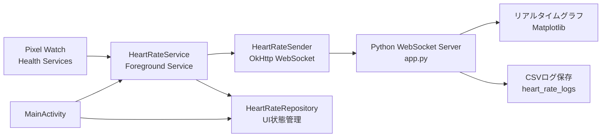

# Pixel Watch と Python 連携システム 全体解説

## 1. このシステムで実現していること

このシステムは、Google Pixel Watch 4 で取得した心拍数を、同じネットワーク上の PC にリアルタイム送信し、Python アプリで受信・可視化・保存する構成です。

役割は大きく 2 つに分かれています。

- Wear OS アプリ側: Pixel Watch から心拍データを取得し、WebSocket で PC に送信する
- Python アプリ側: 心拍データを受信し、グラフ表示しながら CSV に保存する

最小構成の利点は、Android 側と Python 側の責務が明確で、センサー取得、通信、可視化、保存が独立していることです。将来的に、他の生体情報やクラウド保存へ拡張しやすい土台になっています。

## 2. 全体アーキテクチャ



## 3. リポジトリ構成

### 3.1 ルート側

- app.py: WebSocket サーバー、受信処理、リアルタイム描画、CSV 保存
- simulator.py: Watch の代わりにテストデータを送る送信シミュレータ
- requirements.txt: Python 側依存関係
- heart_rate_logs/: 接続ごとに保存される CSV ログ

### 3.2 Wear OS 側

- wearos-sender/app/src/main/java/com/pixelwatch/sender/MainActivity.kt: UI、URL入力、権限要求、開始/停止操作
- wearos-sender/app/src/main/java/com/pixelwatch/sender/HeartRateService.kt: 前景サービス、センサー購読、送信制御
- wearos-sender/app/src/main/java/com/pixelwatch/sender/HeartRateSender.kt: OkHttp WebSocket 送信
- wearos-sender/app/src/main/java/com/pixelwatch/sender/HeartRateRepository.kt: UI 状態共有
- wearos-sender/app/src/main/AndroidManifest.xml: 権限、サービス、cleartext 通信設定

## 4. データの流れ

### 4.1 開始から停止までのシーケンス

1. PC で app.py を起動する
2. Pixel Watch アプリで WebSocket URL を入力する
3. Start を押す
4. MainActivity が権限を確認し、HeartRateService を前景サービスとして起動する
5. HeartRateService が Health Services の MeasureClient で心拍数計測を開始する
6. 心拍サンプルを受け取るたびに HeartRateSender が JSON を生成し、PC へ WebSocket 送信する
7. app.py が JSON を受信し、メモリ上の時系列データを更新する
8. app.py が同時に CSV へ追記し、Matplotlib がグラフを更新する
9. Stop を押すか接続が終了すると、Watch 側は計測停止、PC 側は CSV をクローズする

### 4.2 通信フォーマット

送信メッセージは JSON です。

```json
{
  "timestamp": "2026-06-09T10:15:30Z",
  "bpm": 72
}
```

項目の意味は次のとおりです。

- timestamp: 測定時刻。ISO 8601 文字列。UTC の Z 付き形式を想定
- bpm: 心拍数。整数に丸めた beats per minute

Python 側は受信後に次のような ACK を返します。

```json
{
  "ok": true,
  "bpm": 72
}
```

この ACK は、送信側が最低限「届いたかどうか」を知るための簡易応答です。

## 5. Python 側の実装解説

## 5.1 app.py の責務

app.py は次の 4 つの責務を持っています。

- WebSocket サーバーとして待ち受ける
- 受信した JSON を時刻付き心拍データへ変換する
- 直近データをグラフ表示用メモリに保持する
- 接続単位で CSV ログとして保存する

### 5.2 WebSocket サーバー

Python 側は websockets ライブラリで ws://0.0.0.0:8765 を待ち受けます。0.0.0.0 にしているため、同じ PC 上だけでなく、同一ネットワーク上の Watch からも接続できます。

Matplotlib の GUI ループと asyncio の WebSocket サーバーを両立するため、サーバーは別スレッドで起動しています。これはこの構成の重要なポイントです。

- メインスレッド: Matplotlib の描画
- バックグラウンドスレッド: asyncio WebSocket サーバー

この分離により、GUI を止めずにリアルタイム受信できます。

### 5.3 受信データの解析

受信した文字列は parse_payload で JSON として解釈されます。

- bpm は int に変換される
- timestamp があれば ISO 8601 から datetime へ変換する
- timestamp が無ければ受信時刻を使う

この実装により、送信側が時刻を持たない場合でも最低限の受信テストが可能です。

### 5.4 メモリ保持とリアルタイム描画

心拍データは deque に保存されています。最大 600 件まで保持するため、メモリ増加を抑えつつ、直近のデータだけを扱えます。

表示では WINDOW_SECONDS = 60 により、常に最新 60 秒だけをグラフ表示します。

描画更新の考え方は次のとおりです。

- 最新サンプル時刻を基準にする
- 60 秒以内のサンプルだけを visible として抽出する
- x 軸は時間、y 軸は bpm
- y 軸は 30 から 220 の範囲に収まるように調整しつつ、値の上下に少し余白を持たせる

このため、グラフは長時間動かしても常に読みやすい表示を維持できます。

### 5.5 CSV 保存

接続開始時に 1 セッション 1 ファイルで CSV を作成します。ファイル名は開始時刻ベースです。

例:

```text
heart_rate_20260610_193015.csv
```

保存カラムは次の 2 列です。

- timestamp
- bpm

接続中はサンプル受信ごとに追記し、その都度 flush しています。これにより、途中でアプリが落ちてもログ損失を最小化できます。

### 5.6 排他制御

受信スレッドと描画スレッドが同じデータを扱うため、threading.Lock を使って共有状態を保護しています。

対象は主に次の共有データです。

- samples
- latest_bpm
- CSV 書き込みタイミングに伴う状態更新

このロックがないと、描画中にデータが変更されて不整合が起こる可能性があります。

## 6. simulator.py の役割

simulator.py は Watch がなくても Python 側をテストできる検証用ツールです。

特徴は次のとおりです。

- 1 秒ごとに 1 サンプル送る
- 心拍数を sin 波で揺らし、疑似的に変動するデータを作る
- サーバーからの ACK を受け取って標準出力に表示する

開発時はまず simulator.py で Python 側の受信・保存・描画が正しいかを確認し、その後に Watch 実機を接続する流れが安全です。

## 7. Wear OS 側の実装解説

## 7.1 MainActivity の責務

MainActivity は、Watch 上の操作画面です。主な役割は次のとおりです。

- 送信先 WebSocket URL を入力させる
- URL を SharedPreferences に保存する
- 心拍権限を要求する
- Start と Stop を切り替える
- HeartRateRepository の状態を UI に反映する

設計上のポイントは、UI 自体は計測や通信を直接行わず、サービス起動と状態表示に徹していることです。これにより、画面が閉じても前景サービス側で計測を継続できます。

### 7.2 権限処理

API レベルによって必要権限が異なります。

- API 35 以下: BODY_SENSORS
- API 36 以上: android.permission.health.READ_HEART_RATE

Manifest には背景計測用権限も宣言されています。

- BODY_SENSORS_BACKGROUND
- READ_HEALTH_DATA_IN_BACKGROUND

ただし、実行時に MainActivity が明示的に要求しているのは主要な読み取り権限です。最小構成としては十分ですが、長時間運用や OS 差分対応を強める場合は、権限ハンドリングの追加整理余地があります。

### 7.3 HeartRateService の責務

HeartRateService はこの Watch アプリの中核です。役割は次のとおりです。

- 前景サービスとして生存し続ける
- Health Services の対応可否を確認する
- HEART_RATE_BPM の MeasureCallback を登録する
- 受信した心拍値を WebSocket で送信する
- UI 状態と通知文言を更新する

前景サービスを使っている理由は、画面スリープや UI ライフサイクルから独立して計測を継続するためです。

### 7.4 Health Services からの取得

HeartRateService は HealthServices.getClient(this).measureClient を利用し、HEART_RATE_BPM を購読しています。

MeasureCallback.onDataReceived が呼ばれると、最後のサンプルを取り出して次を行います。

1. 値を四捨五入して整数 bpm にする
2. timeDurationFromBoot を bootInstant に足して実時刻へ戻す
3. HeartRateSender に渡して送信する
4. HeartRateRepository を更新して画面へ反映する
5. 通知文言も更新する

ここで重要なのは、Health Services が返す時刻がブートからの経過時間ベースである点です。実装では、現在時刻と elapsedRealtime から bootInstant を求めて、そこにサンプル時刻を足すことで UTC 時刻相当へ復元しています。

### 7.5 HeartRateSender の責務

HeartRateSender は通信専用コンポーネントです。

- OkHttp WebSocket を生成して接続する
- 心拍サンプルを JSON にして送信する
- 接続成功、切断、失敗の状態をコールバックで通知する

責務をサービス本体から切り出しているため、将来ここだけを差し替えて次のような拡張がしやすくなっています。

- 再接続戦略の実装
- バッファリング
- 送信失敗時の再送
- WebSocket 以外の MQTT や HTTP への差し替え

### 7.6 HeartRateRepository の役割

HeartRateRepository は StateFlow ベースの単純な状態ストアです。画面とサービスの間で次の情報を共有します。

- 動作中かどうか
- 最新 bpm
- 最新タイムスタンプ
- ステータスメッセージ
- 送信先 URL

この構成により、Activity はサービス内部を直接知らずに UI を更新できます。いわば、このプロジェクトにおける最小の単方向データフローです。

## 8. AndroidManifest の重要ポイント

Manifest では、このシステムを成立させるための前提がまとまっています。

- INTERNET: PC へ WebSocket 接続するために必須
- FOREGROUND_SERVICE と FOREGROUND_SERVICE_HEALTH: 心拍計測を前景サービスとして継続するために必要
- BODY_SENSORS 系、READ_HEART_RATE 系: センサー取得用
- POST_NOTIFICATIONS: 前景通知更新用
- usesCleartextTraffic=true: ws:// の平文 WebSocket を許可するために必要

特に usesCleartextTraffic=true は重要です。ローカルネットワークで簡単に接続できる代わりに、通信は暗号化されません。本番用途や外部ネットワーク利用では wss:// 化を検討すべきです。

## 9. 起動と運用の流れ

## 9.1 Python 側の準備

```powershell
python -m venv .venv
.venv\Scripts\Activate.ps1
python -m pip install --upgrade pip
pip install -r requirements.txt
python app.py
```

起動すると、PC は WebSocket サーバーとして待ち受け、グラフ画面が開きます。

## 9.2 Watch 側の準備

1. Android Studio で wearos-sender を開く
2. 実機またはエミュレータへアプリをインストールする
3. Watch と PC を同じネットワークに接続する
4. Watch に ws://PCのIP:8765 を入力する
5. Start を押す

## 9.3 動作確認

最初の確認は simulator.py の利用が簡単です。

```powershell
python simulator.py
```

グラフが更新され、heart_rate_logs に CSV が増えれば、Python 側は正常に動いています。その後に Watch 実機へ切り替えると切り分けがしやすくなります。

## 10. この構成の技術的な良さ

この実装は最小構成ながら、実験・研究・個人開発向けとしてかなり扱いやすい形です。

- センサー取得、送信、受信、可視化、保存が責務分離されている
- JSON over WebSocket で疎結合なのでデバッグしやすい
- CSV 保存があるため後処理や分析に流用しやすい
- simulator.py があり、Watch 非依存で受信側検証ができる
- StateFlow と前景サービスで Watch 側の状態管理が単純明快

## 11. 現状の制約と改善候補

現状は「まず動く最小実装」を優先した構成なので、次の改善余地があります。

### 11.1 通信面

- 自動再接続が弱い
- 切断理由に応じたリトライ制御がない
- ws:// のため暗号化されない

### 11.2 Android 側

- 権限分岐の厳密化余地がある
- 長時間計測では ExerciseClient の方が適する可能性がある
- 通知から停止操作できると実用性が上がる

### 11.3 Python 側

- 複数クライアント同時接続時の扱いは最小限
- エラーログと接続状態表示をもう少し強化できる
- 可視化を Web UI に置き換えると共有しやすい

## 12. まとめ

このプロジェクトは、Pixel Watch の心拍計測を PC にリアルタイム転送し、その場で可視化・保存するためのエンドツーエンドな検証環境です。

設計の中心は、次の 3 点です。

- Watch では Health Services で心拍を取得する
- WebSocket でシンプルな JSON を PC に送る
- Python で受信、グラフ化、CSV 保存を同時に行う

その結果、データ取得から保存までの流れが見通しよく、今後の拡張先も明確です。研究用途、個人計測、プロトタイプ開発の出発点として十分に実用的な構成になっています。