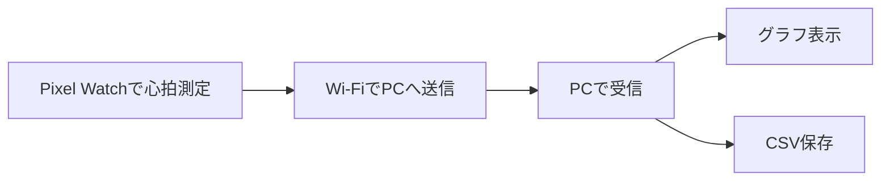

# Pixel Watch と PC 連携システムのやさしい説明

## これは何をするシステム？

このシステムは、Pixel Watch で測った心拍数を、リアルタイムでパソコンに送って表示する仕組みです。

Watch で心拍数を測ると、その値がすぐに PC に送られ、PC では次のことができます。

- 今の心拍数を確認する
- 心拍の変化をグラフで見る
- 記録をファイルとして保存する

つまり、Pixel Watch を「測定する機械」、PC を「見る・残す機械」として使うシステムです。

## ひとことで言うと

Watch で測った心拍を、その場で PC に見えるようにする仕組みです。

## このシステムでできること

- 心拍数をリアルタイムで確認する
- 心拍の上がり下がりをグラフで見る
- 測定結果を CSV という表形式のファイルで保存する
- 保存したデータをあとから見返す

たとえば、次のような場面で役立ちます。

- 運動中や作業中の心拍変化を確認したいとき
- 研究や課題で心拍データを記録したいとき
- Watch のデータを PC でまとめて管理したいとき

## どういう流れで動くの？

全体の流れはとてもシンプルです。

1. Pixel Watch が心拍数を測る
2. Watch がその値を Wi-Fi 経由で PC に送る
3. PC が受け取った値を画面に表示する
4. 同時にファイルにも保存する

図で表すと次のようになります。

## それぞれの役割

### Pixel Watch の役割

Pixel Watch は、心拍数を測って送る担当です。

このプロジェクトでは、Watch の中に専用アプリを入れてあります。このアプリが心拍数を取得して、PC に向けて送信します。

### PC の役割

PC は、受け取って見やすくする担当です。

PC 側では Python という仕組みを使って、Watch から送られてきた心拍数を受信します。そして次の 2 つを同時に行います。

- 画面にグラフとして表示する
- 記録ファイルとして保存する

## PC 画面では何が見えるの？

PC では、心拍数が時間とともにどう変わっているかをグラフで見ることができます。

たとえば、安静時は低め、歩いたり運動したりすると高めになるので、その変化が線で追えます。

また、最新の心拍数も確認できます。これによって、今の状態をその場で把握しやすくなります。

## 保存されるデータは何？

受け取ったデータは CSV ファイルとして保存されます。CSV は Excel などでも開きやすい形式です。

保存される主な内容は次の 2 つです。

- 測定した時刻
- 心拍数

これにより、あとから次のような使い方ができます。

- どの時間に心拍が上がったか確認する
- レポートや発表資料に使う
- 別の分析ツールに読み込む

## なぜ Watch だけでなく PC に送るの？

Watch 単体でも心拍は見られますが、PC に送ると次の利点があります。

- 画面が大きくて見やすい
- データを残しやすい
- 研究や分析に使いやすい
- グラフとして変化を追いやすい

つまり、「その場で見る」だけでなく、「記録して活用する」ことができるようになります。

## 使い方の流れ

使うときの流れは次のとおりです。

1. PC 側の受信プログラムを起動する
2. Pixel Watch 側のアプリを開く
3. Watch から送信先の PC を指定する
4. Start を押して計測を始める
5. PC に心拍データが表示される
6. Stop を押すと計測が終わる

## このシステムのよいところ

このシステムのよいところは、見ながら記録できることです。

- リアルタイムで変化が分かる
- データが自動で保存される
- Watch と PC の役割が分かれていて分かりやすい
- 今後ほかのデータにも広げやすい

たとえば将来、心拍だけでなく歩数や別の健康データも扱う方向へ広げることも考えられます。

## 今の段階での位置づけ

このシステムは、まずしっかり動くことを重視した試作版に近い構成です。

そのため、基本機能はそろっています。

- Watch で測る
- PC に送る
- グラフで見る
- ファイルに残す

一方で、将来的には次のような改良も考えられます。

- 接続が切れたときに自動でつなぎ直す
- より見やすい画面にする
- 送ったデータをもっと安全に保護する

## まとめ

このプロジェクトは、Pixel Watch で測った心拍数を PC に送って、その場で見えて、あとから残せるようにした仕組みです。

難しい言い方を避けると、次の一文にまとまります。

「腕時計で測った体の情報を、パソコンで見える化して保存するシステム」です。

心拍の変化をその場で確認したい場合にも、後でデータを使いたい場合にも役立つ、分かりやすく実用的な構成になっています。