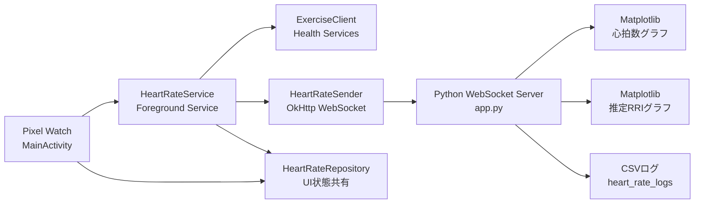

# Pixel Watch と Python 連携システム 全体解説

## 1. このシステムで実現していること

このシステムは、Google Pixel Watch 4 で取得した心拍データを PC にリアルタイム送信し、Python アプリで受信・可視化・CSV 保存する構成です。

現在の実装では、単なる心拍表示だけではなく、次の点まで一通りそろっています。

- Watch で Start を押すと計測と送信が始まる
- PC 側で 1 セッション 1 ファイルの CSV が作られる
- 心拍数と、そこから計算した推定 RRI をリアルタイム表示する
- Stop または切断でセッションを閉じる
- Watch の画面が暗くなっても継続しやすいよう、Health Services の ExerciseClient ベースで動作する

研究用の試作、個人計測、PC 側でのリアルタイム観察に向いた、端から端まで通った構成になっています。

## 2. 全体アーキテクチャ



役割分担はかなり明確です。

- Watch 側: 心拍取得、送信、状態管理
- PC 側: 受信、可視化、保存

この分離のおかげで、Watch 側はセンサーと通信に集中し、PC 側は観察と記録に集中できます。配線が見える設計なので、あとから機能を足しても迷子になりにくいです。

## 3. リポジトリ構成

### 3.1 ルート側

- app.py: WebSocket サーバー、受信処理、CSV 保存、リアルタイム描画
- simulator.py: Watch の代わりに疑似データを送る検証ツール
- requirements.txt: Python 依存関係
- heart_rate_logs/: セッションごとの CSV 出力先
- PIXEL_WATCH_PYTHON_SYSTEM.md: このシステム解説

### 3.2 Wear OS 側

- wearos-sender/app/src/main/java/com/pixelwatch/sender/MainActivity.kt: UI、URL 入力、権限要求、Start/Stop
- wearos-sender/app/src/main/java/com/pixelwatch/sender/HeartRateService.kt: 前景サービス、ExerciseClient 制御、送信制御
- wearos-sender/app/src/main/java/com/pixelwatch/sender/HeartRateSender.kt: OkHttp WebSocket 送信
- wearos-sender/app/src/main/java/com/pixelwatch/sender/HeartRateRepository.kt: UI 状態共有
- wearos-sender/app/src/main/AndroidManifest.xml: 権限とサービス宣言

## 4. 開始から停止までの流れ

### 4.1 起動シーケンス

1. PC で app.py を起動する
2. Watch アプリで送信先 URL を入力する
3. Start を押す
4. MainActivity が必要権限を確認し、HeartRateService を前景サービスとして起動する
5. HeartRateService が ExerciseClient で運動セッションを開始する
6. 心拍サンプルが届くたびに HeartRateSender が JSON で PC に送信する
7. app.py が受信したデータをメモリ、CSV、グラフに反映する
8. Stop を押すと Watch 側は計測を止め、PC 側はその接続セッションの CSV を閉じる

### 4.2 データの流れ

Watch から送るメッセージは JSON です。

```json
{
  "timestamp": "2026-06-11T10:15:30Z",
  "bpm": 72
}
```

項目の意味は次のとおりです。

- timestamp: Watch 側のサンプル時刻。UTC の ISO 8601 文字列
- bpm: 心拍数。整数化した beats per minute

PC 側は正常受信時に簡単な ACK を返します。

```json
{
  "ok": true,
  "bpm": 72
}
```

この ACK は送信成功保証の仕組みではありませんが、最低限「受信処理まで届いた」ことは分かります。

## 5. Python 側の実装解説

## 5.1 app.py の責務

app.py は現在、次の 5 つを担当しています。

- WebSocket サーバーとして待ち受ける
- 受信 JSON を時刻付き心拍データへ変換する
- 推定 RRI を計算する
- 心拍数と推定 RRI をリアルタイム描画する
- 接続単位で CSV を保存する

## 5.2 受信処理

サーバーは ws://0.0.0.0:8765 を待ち受けます。0.0.0.0 なので、同じ PC だけでなく同一ネットワーク上の Watch からも接続できます。

受信文字列は parse_payload で次のように処理されます。

- JSON として読み込む
- bpm を整数化する
- timestamp があれば ISO 8601 として解釈する
- タイムゾーンは JST にそろえる
- timestamp が無ければ PC 側の現在時刻を JST で補う

ここで重要なのは、現在のコードでは CSV の時刻を日本時間で保存していることです。以前の説明では UTC 前提でしたが、現状は JST へ変換してから扱っています。

## 5.3 セッション管理

現在の PC 側は 1 接続 = 1 セッションです。接続開始時に CSV を新規作成し、切断時に閉じます。

ファイル名はセッション開始時刻ベースです。

```text
heart_rate_YYYYMMDD_HHMMSS.csv
```

さらに、接続開始時には次もリセットされます。

- メモリ上のサンプル列
- 画面に出す最新 bpm
- 画面に出す最新推定 RRI
- 画面に出す最新時刻

このリセットがあるため、前の計測の残像が次の Start に混ざりません。

## 5.4 CSV 保存仕様

現在の CSV 列は次の 4 列です。

- timestamp
- elapsed_seconds
- bpm
- estimated_rri_ms

意味は次のとおりです。

- timestamp: JST に変換された測定時刻
- elapsed_seconds: そのセッションの最初のサンプルからの経過秒
- bpm: 心拍数
- estimated_rri_ms: bpm から計算した推定 RRI

推定 RRI は次の式で計算しています。

$$
\mathrm{estimated\_rri\_ms} = \frac{60000}{\mathrm{bpm}}
$$

これは真の拍動間隔ではなく、BPM から逆算した推定値です。つまり、RRI という名前ではありますが、厳密には beat-to-beat の RR interval を直接測っているわけではありません。ここは使い方を誤解しやすいので、現状のコード上でも意識的に estimated としています。

## 5.5 グラフ表示

app.py は Matplotlib で 2 段のグラフを描きます。

- 上段: 心拍数
- 下段: 推定 RRI

現在の表示仕様は次のとおりです。

- 横軸は時計時刻ではなく、セッション開始からの経過秒
- 表示対象は直近 60 秒のサンプル
- 心拍グラフの y 軸は 60 から 120、20 刻み
- 推定 RRI グラフの y 軸は 500 から 1000、100 刻み
- 最新値はテキストでも表示する

心拍と推定 RRI を上下に並べたことで、数値の関係が見やすくなっています。片方を見るともう片方も自然に目に入るので、実験中の観察には素直なレイアウトです。

## 5.6 スレッドと排他制御

Matplotlib の描画と WebSocket 受信は別の流れで動くため、共有状態は lock で保護されています。

主に保護しているのは次です。

- samples
- latest_metrics
- CSV 追記タイミングを含む更新処理

このロックがないと、描画中に別スレッドがデータを書き換えて表示崩れや不整合が起こる可能性があります。

## 6. Wear OS 側の実装解説

## 6.1 MainActivity の役割

MainActivity は Watch 上の操作画面です。やっていることはかなり整理されています。

- 送信先 URL の入力
- URL の保存と再読み込み
- 権限確認と要求
- Start/Stop ボタンの制御
- HeartRateRepository の状態を UI に反映

重要なのは、MainActivity 自体は心拍取得や WebSocket 送信を直接行わないことです。実処理は HeartRateService に寄せられており、UI は制御盤に徹しています。この分離があるので、画面が前面にいなくても計測処理は続けやすくなっています。

## 6.2 権限処理

現在の MainActivity は、Android バージョンに応じて必要権限を切り替えています。

- API 36 以上:
  - android.permission.health.READ_HEART_RATE
  - android.permission.health.READ_HEALTH_DATA_IN_BACKGROUND
- API 33 から 35:
  - BODY_SENSORS
  - BODY_SENSORS_BACKGROUND

ここでのポイントは、現行コードが背景取得権限まで実行時要求していることです。以前の構成ではここが弱く、画面が暗くなると止まりやすい要因の一つでした。現在はその点を補強しています。

## 6.3 HeartRateService の役割

HeartRateService は Watch 側の中核です。役割を一言でまとめると、計測・送信・状態同期の司令塔です。

主な仕事は次のとおりです。

- 前景サービスとして動き続ける
- ExerciseClient の対応可否を確認する
- 運動セッションを開始する
- 心拍アップデートを受け取り WebSocket で送信する
- UI 状態と通知を更新する
- Stop や異常終了に応じて後始末する

前景サービスにしているのは、UI の寿命とは切り離して継続計測したいからです。心拍を取り続ける処理を Activity に載せると、画面都合に引きずられやすくなります。

## 6.4 なぜ ExerciseClient なのか

現在の実装は MeasureClient ではなく ExerciseClient を使っています。これは長めの継続計測で安定させるためです。

以前は MeasureClient ベースの説明でしたが、現在のコードでは完全に ExerciseClient へ移行済みです。HeartRateService は次の流れでセッションを開始します。

1. ExerciseType.WALKING の capabilities を確認する
2. HEART_RATE_BPM がサポートされているか確認する
3. ExerciseConfig を作る
4. startExerciseAsync で運動セッションを開始する
5. setUpdateCallback で更新コールバックを登録する

この順序も重要です。現在のコードでは startExerciseAsync 成功後に callback を登録しています。これは、開始前後の状態更新が競合して Start 直後に停止状態へ戻る問題を避けるためです。

## 6.5 ExerciseUpdate の処理

HeartRateService の onExerciseUpdateReceived は、現在かなり実運用寄りの防御を持っています。

- stopRequested が立っていたら更新を無視する
- まだ本格始動前なのに ended 扱いの更新が来たら無視する
- 本当に ended なら理由コード付きで停止処理へ進む
- latestMetrics から HEART_RATE_BPM の全サンプルを取り出す
- 各サンプルを WebSocket 送信する
- 最後のサンプルを UI 表示用の最新値として反映する

ここで「全サンプルを送る」実装になっているのも今のコードの特徴です。1 回の ExerciseUpdate に複数サンプルが含まれていたとき、最後の 1 件だけを捨てずに全部送るため、アプリ側での取りこぼしを減らしています。

## 6.6 時刻の扱い

ExerciseClient から得るサンプル時刻は、単純な壁時計時刻ではなくブート基準の情報を含みます。そのため HeartRateService は bootInstant を求め、sample.getTimeInstant(bootInstant) で実時刻へ復元しています。

その後、HeartRateSender はその Instant を ISO 8601 文字列にして PC へ送ります。PC 側はそれを JST に変換して表示・保存します。

つまり時刻の流れはこうです。

- Watch 内部: サンプル時刻を Instant 化
- 通信: UTC の ISO 8601 文字列
- PC 保存: JST に変換して CSV へ出力

## 6.7 HeartRateSender の役割

HeartRateSender は通信専用の小さな部品です。

- 指定 URL に WebSocket 接続する
- 心拍サンプルを JSON 化して送る
- 接続成功、切断、失敗をステータスメッセージとして返す

責務が分離されているので、HeartRateService はセンサー制御に集中できます。将来的に自動再接続、バッファリング、別プロトコル対応を入れるなら、このクラスが拡張点になります。

## 6.8 HeartRateRepository の役割

HeartRateRepository は、Watch 側の共有状態を StateFlow で持つ単純なストアです。

保持している主な項目は次です。

- isRunning
- latestBpm
- latestTimestamp
- statusMessage
- serverUrl

Activity と Service が直接お互いを引っ張り回さず、この状態を通して連携する形になっています。小さいながらも筋の良い構成です。

## 7. AndroidManifest の重要ポイント

Manifest には、このシステムを成立させるための前提がまとまっています。

- INTERNET: PC へ WebSocket 接続するために必要
- FOREGROUND_SERVICE: 前景サービス実行に必要
- FOREGROUND_SERVICE_HEALTH: 健康データ用の前景サービス種別に必要
- POST_NOTIFICATIONS: 通知更新に必要
- BODY_SENSORS / BODY_SENSORS_BACKGROUND: API 35 以下向け
- READ_HEART_RATE / READ_HEALTH_DATA_IN_BACKGROUND: 新しい Health permission 向け
- usesCleartextTraffic=true: ws:// を使うために必要

usesCleartextTraffic=true はローカル検証では便利ですが、通信は暗号化されません。家庭内や研究室内の簡易構成には向いていますが、外部ネットワークで使うなら wss:// 化や認証の導入を検討すべきです。

## 8. 現在の強み

今のコード状態での強みは次のとおりです。

- Watch 側と PC 側の責務分離が明確
- 長時間計測寄りに ExerciseClient へ移行済み
- 背景権限と前景サービスで継続性を意識した構成
- CSV がセッション単位で整理される
- グラフが心拍数と推定 RRI の両方をリアルタイム表示する
- セッション開始時に古い表示状態を持ち越さない

特に「Start したセッションだけを観察・保存する」という振る舞いが全体でそろっているので、実験ログとして扱いやすくなっています。

## 9. 現在の制約

現状の制約もあります。

- RRI は推定値であり、真の beat-to-beat RR interval ではない
- 心拍サンプルの更新間隔は主に Health Services 側の供給 cadence に依存する
- 通信は ws:// 前提で暗号化されていない
- 自動再接続や再送はまだ入っていない
- PC 側は単一接続を前提にした軽量構成で、多数同時接続向けではない

特に推定 RRI は、拍ごとの厳密解析とは用途が異なります。ここは数値がそれっぽく見えるだけに、説明を雑にすると危ない部分です。

## 10. 起動手順

### 10.1 Python 側

```powershell
python -m venv .venv
.venv\Scripts\Activate.ps1
python -m pip install --upgrade pip
pip install -r requirements.txt
python app.py
```

起動すると、WebSocket サーバーが立ち上がり、心拍数と推定 RRI のグラフ画面が開きます。

### 10.2 Watch 側

1. Android Studio で wearos-sender を開く
2. Pixel Watch にアプリをインストールする
3. Watch と PC を同じネットワークに接続する
4. Watch に ws://PCのIP:8765 を入力する
5. Start を押す

### 10.3 簡易確認

Watch を使う前に simulator.py で PC 側だけ確認することもできます。

```powershell
python simulator.py
```

グラフが動き、heart_rate_logs に CSV が作られれば、PC 側の受信・保存・表示は概ね正常です。

## 11. まとめ

現在のこのシステムは、Pixel Watch で取得した心拍データを、ExerciseClient ベースで安定寄りに収集し、PC へ WebSocket 送信し、Python 側でリアルタイム可視化とセッション単位保存を行う構成です。

設計の芯は次の 3 点です。

- Watch 側は計測と送信に集中する
- PC 側は受信、可視化、保存に集中する
- セッション単位でデータを整理して観察しやすくする

その結果、試作としては十分に実用的で、しかも次の拡張先が読みやすい状態になっています。心拍計測の配線図がそのまま動いている、というのが今のシステムの一番分かりやすい姿です。